# Juan Sebastián Medina Cordero
# A00371957
# Ansible Training

The following practice consists of using terraform to deploy a virtual machine in Azure and with ansible running remotely the deployment of a game.

We use the following base code consisting of an inventory which has a hosts.ini file containing what will be our IP and the password assigned to it.

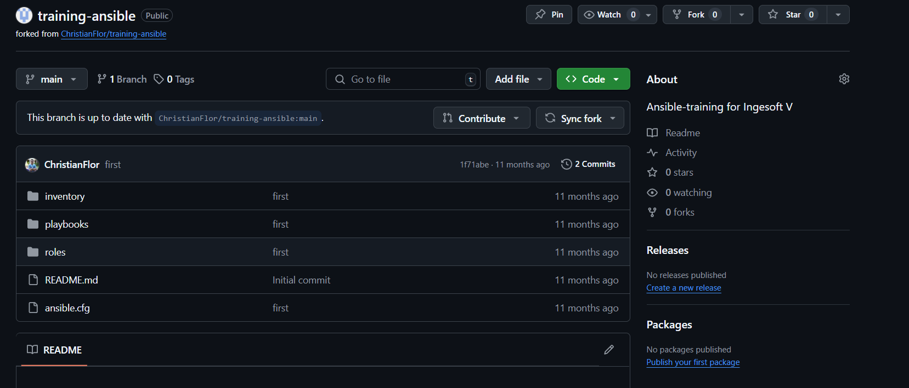

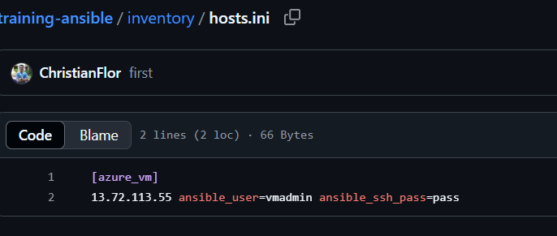

We also have some playbooks that redirect to roles which have the execution steps for the installation of docker and the execution of the service.

What we have to do then is to add a terraform file that creates a virtual machine in the Azure cloud.

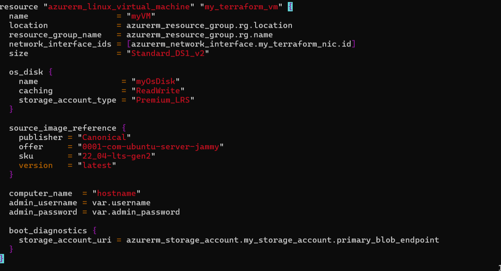

And we do some changes the addition of an admin password reference, and the replacement of key authentication to password authentication when running ssh.

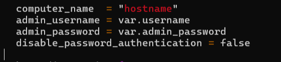

We can initialize the VM mounting process by executing terraform init, this brings our needed dependencies.

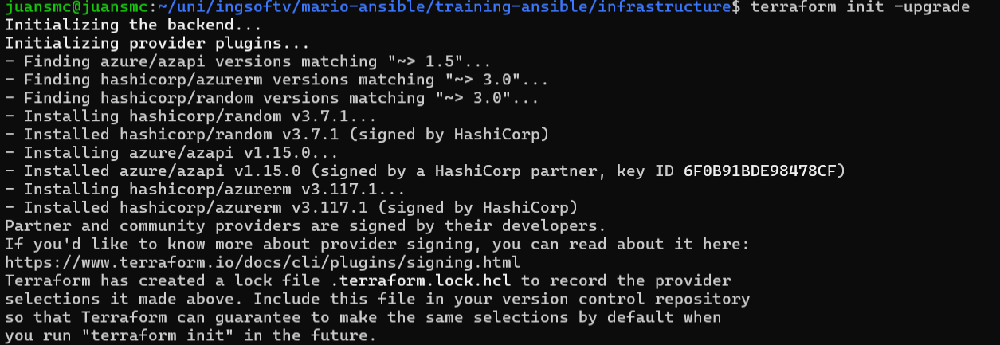

Then we run terraform plan which will create a plan file and will ask for our administrator password as it is needed for the deployment of the VM.

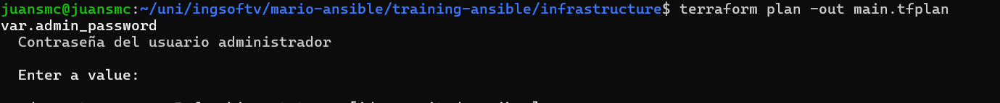

And finally we apply using our plan file, this starts the process of deployment.

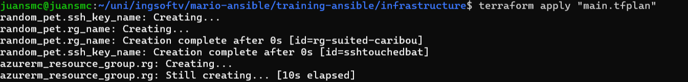

Finally we get our machine's public IP address.

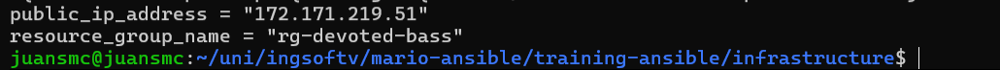

And we can check in the Azure portal that it is indeed active.

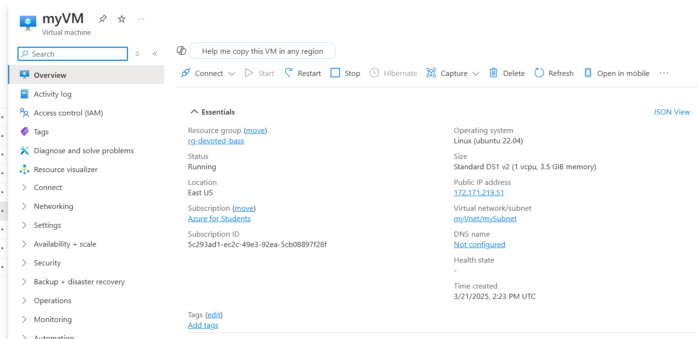

We have to connect to the vm initially so it gets added to the known hosts.

And we replace the values defined on the hosts.ini file.

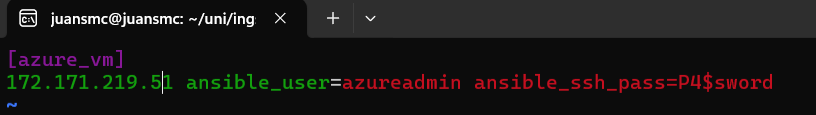

After that we can check the ansible connection with the vm with the following command.

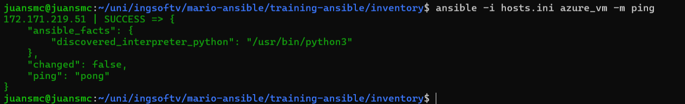

After we have proven there is connection with the machine using ansible we can run the ansible playbook for installing docker in the vm by referencing the hosts.ini file and and the playbook we want to run.

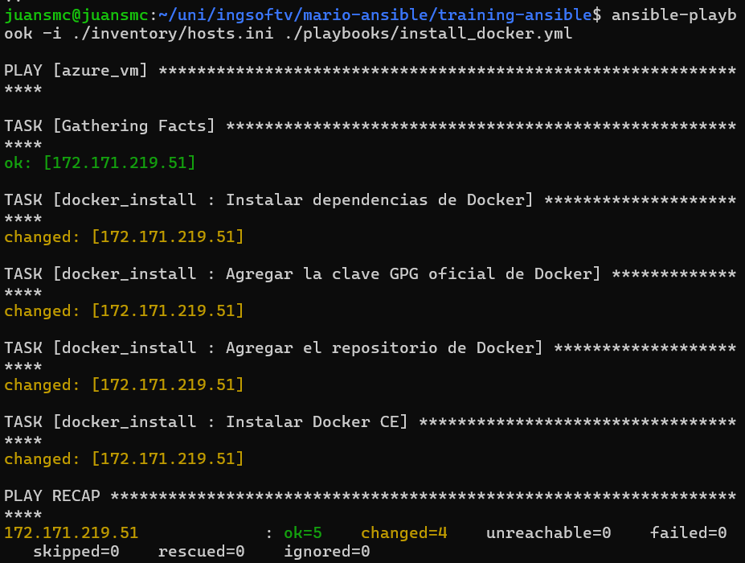

Then we ran our run container playbook. We can see that there is a problem when running this playbook referring to the absence of docker in the python libraries.

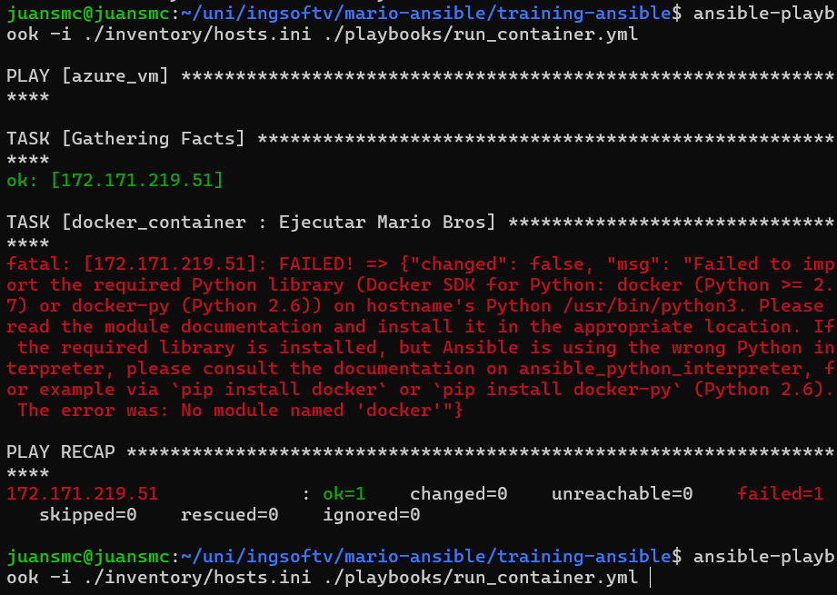

The way of fixing this problem is to connect to the virtual machine with ssh and running the command shown in the error message.

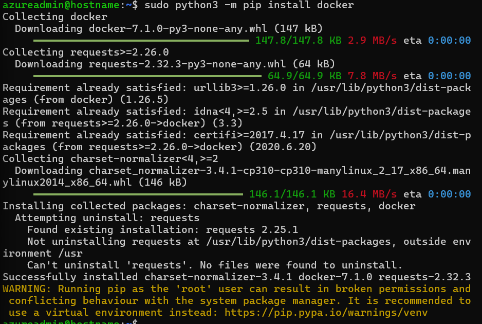

When we try running it back it worked.

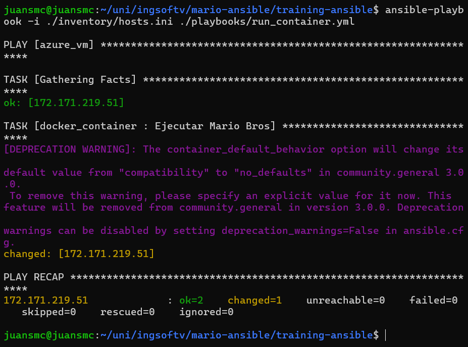

Now we find another problem, when checking the docker container roles file we can notice the service should be running on the port 8787

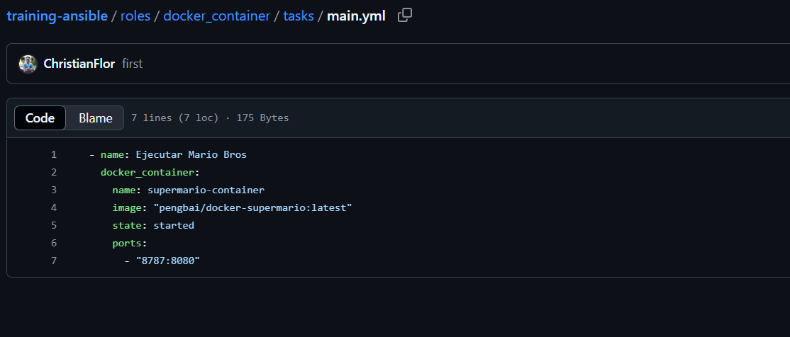

But when accessing it it does not respond.

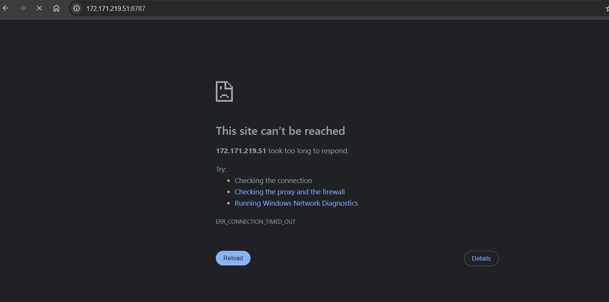

After checking the security rules of the vm the only open port for ingress is ssh port 22.

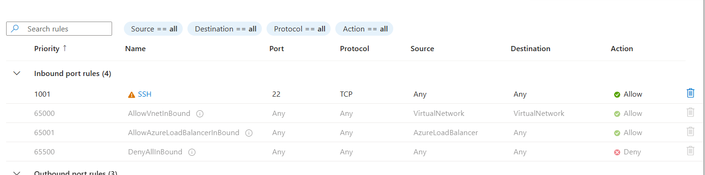

We have to add a rule to enable TCP access on port 8787.

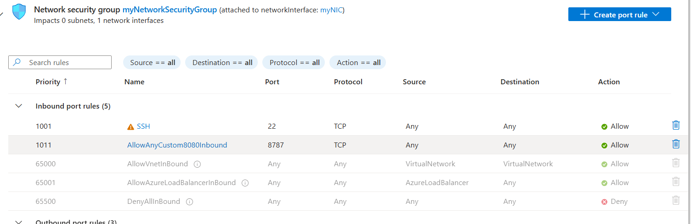

And lastly we can access our game.

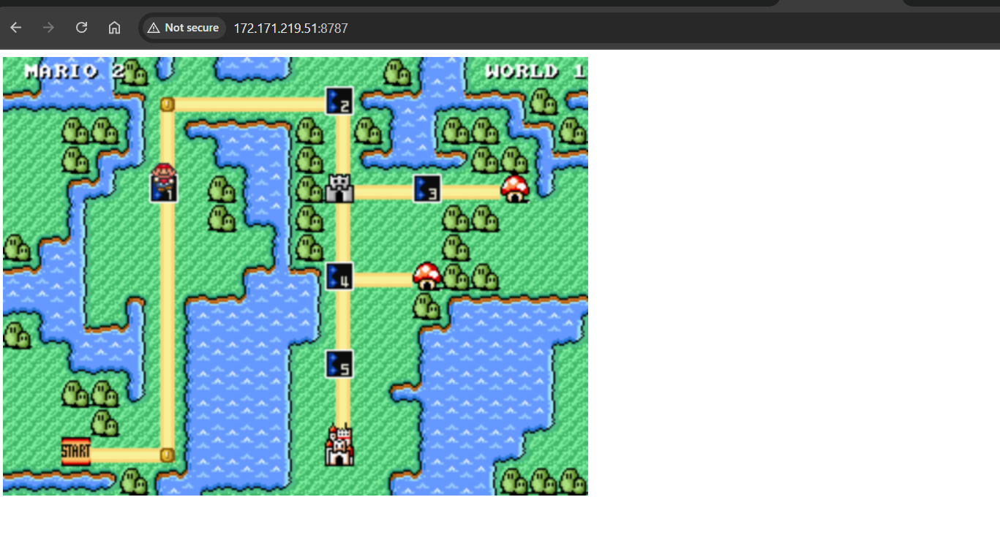

We have to remember to stop our service from running and our infrastructure elements.

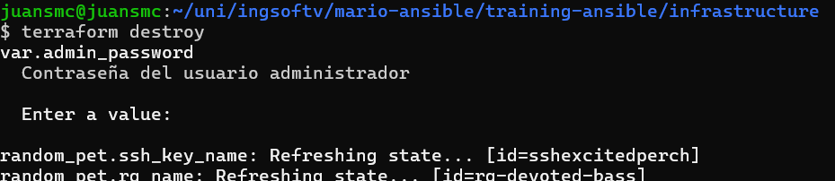

And it dismounts everything we had built.

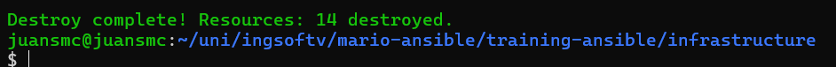
